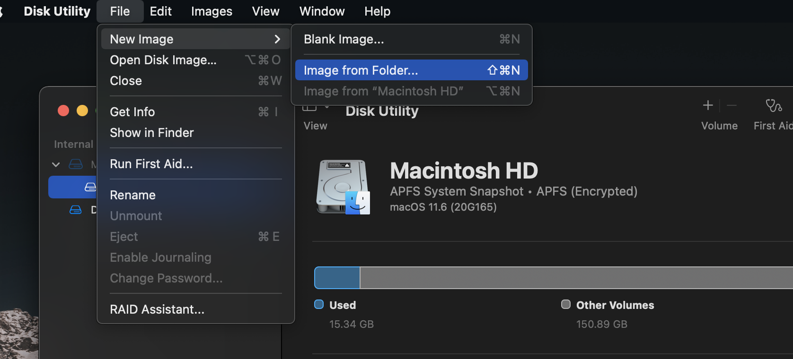
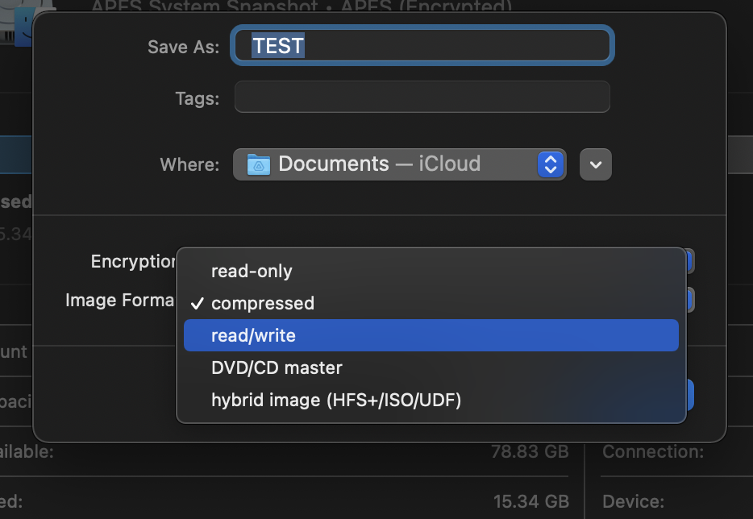
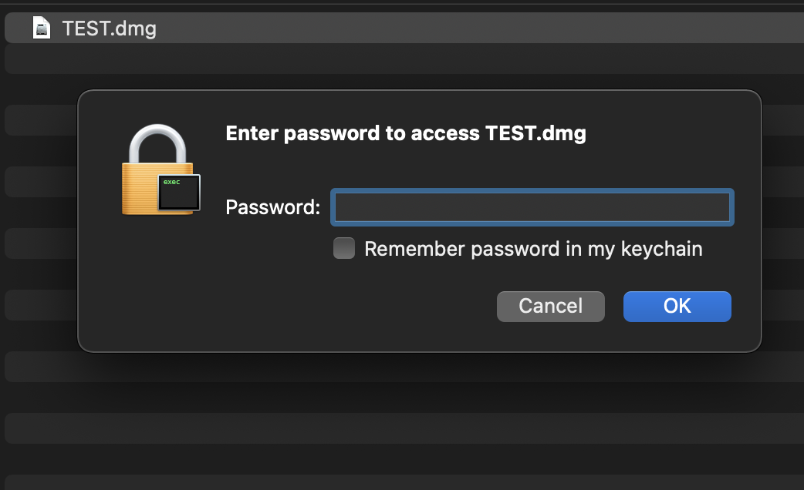

To-do: Add sandboxing applications (Firejail-like sandboxing, built-in feature), 

---

TOC:
- File/Folder Encryption (Disk Utility)
- Keychain Internals

# MacOS_Security

# MacOS Security & tools

[Objective-See](https://www.objective-see.com/products.html)

[Macops - Google Repo / scripts & tools](https://github.com/google/macops)


# File/Folder encryption:

Encryption of existing or new folders:

1.- Search for Disk utility in Spotlight

2.- Creating a new image:

File > New Image > Image from folder



3.- Create a new encrypted image

Select name, encryption (AES 128 or 256 bits), select read/write schema so it can be mounted to the filesystem, and select a password.



This will generate a new file with a .dmg extension (Never erase this file, since it's the root folder which will be decrypted and mounted temporarily into the FS)

Double click this file to enter the password, and it will be mounted into the FS.




This will be mounted until restart, so to unmount it manually we need to eject it.

---

# Apple Keychain internals

This document provides a reference of study to analyze how the `security` tool works in macOS.

You can find the full source code in <https://opensource.apple.com> (direct link to the latest version at the time of this writing [here](https://opensource.apple.com/source/Security/Security-58286.220.15/)).

## Types of items in a keychain

Those are defined in `OSX/libsecurity_keychain/lib/SecKeychainItem.h`:

- User and application defined passwords are class `genp`.
- Passwords stored by Safari (and others?) are class `inet`.

```
typedef CF_ENUM(FourCharCode, SecItemClass)
{
    kSecInternetPasswordItemClass   = 'inet',
    kSecGenericPasswordItemClass    = 'genp',
    kSecAppleSharePasswordItemClass   CF_ENUM_DEPRECATED(10_0, 10_9, NA, NA) = 'ashp',
    kSecCertificateItemClass        = 0x80001000,
    kSecPublicKeyItemClass          = 0x0000000F,
    kSecPrivateKeyItemClass         = 0x00000010,
    kSecSymmetricKeyItemClass       = 0x00000011
};
```

Beware these categories do not follow exactly the UI, which also handles "Secure Notes":


## Types of attributes

In the file `OSX/libsecurity_keychain/lib/SecKeychainItem.h` we find the next structure, whose comments are shown in the table below.

```
typedef CF_ENUM(FourCharCode, SecItemAttr)
{
    kSecCreationDateItemAttr        = 'cdat',
    kSecModDateItemAttr             = 'mdat',
    kSecDescriptionItemAttr         = 'desc',
    kSecCommentItemAttr             = 'icmt',
    kSecCreatorItemAttr             = 'crtr',
    kSecTypeItemAttr                = 'type',
    kSecScriptCodeItemAttr          = 'scrp',
    kSecLabelItemAttr               = 'labl',
    kSecInvisibleItemAttr           = 'invi',
    kSecNegativeItemAttr            = 'nega',
    kSecCustomIconItemAttr          = 'cusi',
    kSecAccountItemAttr             = 'acct',
    kSecServiceItemAttr             = 'svce',
    kSecGenericItemAttr             = 'gena',
    kSecSecurityDomainItemAttr      = 'sdmn',
    kSecServerItemAttr              = 'srvr',
    kSecAuthenticationTypeItemAttr  = 'atyp',
    kSecPortItemAttr                = 'port',
    kSecPathItemAttr                = 'path',
    kSecVolumeItemAttr              = 'vlme',
    kSecAddressItemAttr             = 'addr',
    kSecSignatureItemAttr           = 'ssig',
    kSecProtocolItemAttr            = 'ptcl',
    kSecCertificateType             = 'ctyp',
    kSecCertificateEncoding         = 'cenc',
    kSecCrlType                     = 'crtp',
    kSecCrlEncoding                 = 'crnc',
    kSecAlias                       = 'alis'
};
```

 | Name | Description |
 |------|-------------|
 | `cdat` | (read-only) Identifies the creation date attribute. You use this tag to get a value of type string that represents the date the item was created, expressed in Zulu Time format ("YYYYMMDDhhmmSSZ"). This format is identical to CSSM_DB_ATTRIBUTE_FORMAT_TIME_DATE (cssmtype.h). When specifying the creation date as input to a function (e.g. SecKeychainSearchCreateFromAttributes), you may alternatively provide a numeric value of type UInt32 or SInt64, expressed as seconds since 1/1/1904 (DateTimeUtils.h). |
 | `mdat` | (read-only) Identifies the modification date attribute. You use this tag to get a value of type string that represents the last time the item was updated, expressed in Zulu Time format ("YYYYMMDDhhmmSSZ"). This format is identical to CSSM_DB_ATTRIBUTE_FORMAT_TIME_DATE (cssmtype.h). When specifying the modification date as input to a function (e.g. SecKeychainSearchCreateFromAttributes), you may alternatively provide a numeric value of type UInt32 or SInt64, expressed as seconds since 1/1/1904 (DateTimeUtils.h). |
 | `desc` | Identifies the description attribute. You use this tag to set or get a value of type string that represents a user-visible string describing this particular kind of item (e.g. "disk image password"). |
 | `icmt` | Identifies the comment attribute. You use this tag to set or get a value of type string that represents a user-editable string containing comments for this item. |
 | `crtr` | Identifies the creator attribute. You use this tag to set or get a value of type FourCharCode that represents the item's creator. |
 | `type` | Identifies the type attribute. You use this tag to set or get a value of type FourCharCode that represents the item's type. |
 | `scrp` | Identifies the script code attribute. You use this tag to set or get a value of type ScriptCode that represents the script code for all strings. (Note: use of this attribute is deprecated; string attributes should always be stored in UTF-8 encoding.) |
 | `labl` | Identifies the label attribute. You use this tag to set or get a value of type string that represents a user-editable string containing the label for this item. |
 | `invi` | Identifies the invisible attribute. You use this tag to set or get a value of type Boolean that indicates whether the item is invisible (i.e. should not be displayed). |
 | `nega` | Identifies the negative attribute. You use this tag to set or get a value of type Boolean that indicates whether there is a valid password associated with this keychain item. This is useful if your application doesn't want a password for some particular service to be stored in the keychain, but prefers that it always be entered by the user. The item (typically invisible and with zero-length data) acts as a placeholder to say "don't use me." |
 | `cusi` | Identifies the custom icon attribute. You use this tag to set or get a value of type Boolean that indicates whether the item has an application-specific icon. To do this, you must also set the attribute value identified by the tag kSecTypeItemAttr to a file type for which there is a corresponding icon in the desktop database, and set the attribute value identified by the tag kSecCreatorItemAttr to an appropriate application creator type. If a custom icon corresponding to the item's type and creator can be found in the desktop database, it will be displayed by Keychain Access. Otherwise, default icons are used. (Note: use of this attribute is deprecated; custom icons for keychain items are not supported in Mac OS X.) |
 | `acct` | Identifies the account attribute. You use this tag to set or get a string that represents the user account. This attribute applies to generic, Internet, and AppleShare password items. |
 | `svce` | Identifies the service attribute. You use this tag to set or get a string that represents the service associated with this item. This attribute is unique to generic password items. |
 | `gena` | Identifies the generic attribute. You use this tag to set or get a value of untyped bytes that represents a user-defined attribute.  This attribute is unique to generic password items. |
 | `sdmn` | Identifies the security domain attribute. You use this tag to set or get a value that represents the Internet security domain. This attribute is unique to Internet password items. |
 | `srvr` | Identifies the server attribute. You use this tag to set or get a value of type string that represents the Internet server's domain name or IP address. This attribute is unique to Internet password items. |
 | `atyp` | Identifies the authentication type attribute. You use this tag to set or get a value of type SecAuthenticationType that represents the Internet authentication scheme. This attribute is unique to Internet password items. |
 | `port` | Identifies the port attribute. You use this tag to set or get a value of type UInt32 that represents the Internet port number. This attribute is unique to Internet password items. |
 | `path` | Identifies the path attribute. You use this tag to set or get a string value that represents the path. This attribute is unique to Internet password items. |
 | `vlme` | Identifies the volume attribute. You use this tag to set or get a string value that represents the AppleShare volume. This attribute is unique to AppleShare password items. Note: AppleShare passwords are no longer used by OS X as of Leopard (10.5); Internet password items are used instead. |
 | `addr` | Identifies the address attribute. You use this tag to set or get a string value that represents the AppleTalk zone name, or the IP or domain name that represents the server address. This attribute is unique to AppleShare password items. Note: AppleShare passwords are no longer used by OS X as of Leopard (10.5); Internet password items are used instead. |
 | `ssig` | Identifies the server signature attribute. You use this tag to set or get a value of type SecAFPServerSignature that represents the server signature block. This attribute is unique to AppleShare password items. Note: AppleShare passwords are no longer used by OS X as of Leopard (10.5); Internet password items are used instead. |
 | `ptcl` | Identifies the protocol attribute. You use this tag to set or get a value of type SecProtocolType that represents the Internet protocol. This attribute applies to AppleShare and Internet password items. |
 | `ctyp` | Indicates a CSSM_CERT_TYPE type. |
 | `cenc` | Indicates a CSSM_CERT_ENCODING type. |
 | `crtp` | Indicates a CSSM_CRL_TYPE type. |
 | `crnc` | Indicates a CSSM_CRL_ENCODING type. |
 | `alis` | Indicates an alias. |


## Protocol codes

In the file `OSX/libsecurity_keychain/lib/SecKeychain.h` we find the char code for the protocols supported, which may contain spaces or have uncommon spellings to fit into 4 characters:

```
typedef CF_ENUM(FourCharCode, SecProtocolType)
{
    kSecProtocolTypeFTP         = 'ftp ',
    kSecProtocolTypeFTPAccount  = 'ftpa',
    kSecProtocolTypeHTTP        = 'http',
    kSecProtocolTypeIRC         = 'irc ',
    kSecProtocolTypeNNTP        = 'nntp',
    kSecProtocolTypePOP3        = 'pop3',
    kSecProtocolTypeSMTP        = 'smtp',
    kSecProtocolTypeSOCKS       = 'sox ',
    kSecProtocolTypeIMAP        = 'imap',
    kSecProtocolTypeLDAP        = 'ldap',
    kSecProtocolTypeAppleTalk   = 'atlk',
    kSecProtocolTypeAFP         = 'afp ',
    kSecProtocolTypeTelnet      = 'teln',
    kSecProtocolTypeSSH         = 'ssh ',
    kSecProtocolTypeFTPS        = 'ftps',
    kSecProtocolTypeHTTPS       = 'htps',
    kSecProtocolTypeHTTPProxy   = 'htpx',
    kSecProtocolTypeHTTPSProxy  = 'htsx',
    kSecProtocolTypeFTPProxy    = 'ftpx',
    kSecProtocolTypeCIFS        = 'cifs',
    kSecProtocolTypeSMB         = 'smb ',
    kSecProtocolTypeRTSP        = 'rtsp',
    kSecProtocolTypeRTSPProxy   = 'rtsx',
    kSecProtocolTypeDAAP        = 'daap',
    kSecProtocolTypeEPPC        = 'eppc',
    kSecProtocolTypeIPP         = 'ipp ',
    kSecProtocolTypeNNTPS       = 'ntps',
    kSecProtocolTypeLDAPS       = 'ldps',
    kSecProtocolTypeTelnetS     = 'tels',
    kSecProtocolTypeIMAPS       = 'imps',
    kSecProtocolTypeIRCS        = 'ircs',
    kSecProtocolTypePOP3S       = 'pops',
    kSecProtocolTypeCVSpserver  = 'cvsp',
    kSecProtocolTypeSVN         = 'svn ',
    kSecProtocolTypeAny         =  0
};
```
